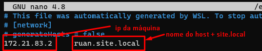
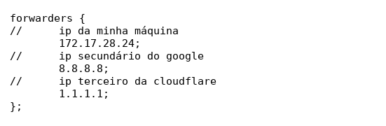
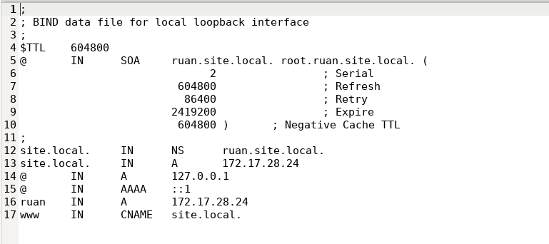
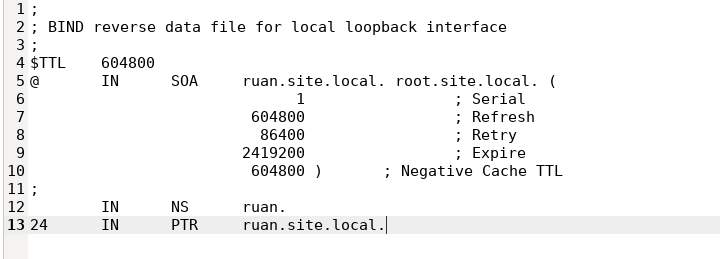

# Configurando DNS local com BIND9 - Linux

- **Tópicos**

  - 1. [Entendendo os campos](#cada-campo-de-domínio)
  - 2. [Editando as interfaces](#editar-as-interfaces)
  - 3. [Instalação do bind9](#instalando-o-bind9)
    - 1. [Configurando](#configurando-o-bind9)

### Cada campo de domínio
|    TIPO    |     SIGNIFICADO     |   O QUE ELE FAZ   |
| ------------- | ------------- | ------------- |
| A | Hostname |Indica o hostname, aonde vincula o domínio ao IP|
| AAAA | Hostname ipv6 | Indica o hostname, aonde vincula o domínio ao IPv6|
| NS | NameService | Servidores de DNS responsáveis pela resolução de cada IP |
| CNAME | Canonical Name (apelido) | Apelido para o hostname A |
| MX | Mail eXchanger | Servidores de e-mail |
| PTR | Pointer | Aponta para o domínio reverso |
| SOA | Start Of Authority | Responsável pelo domínio |

### Editar as interfaces
- Acesse o arquivo de interfaces

  ```
  sudo nano /etc/network/interfaces
  ```
- Cole o seguinte código
  > Ele vai variar de acordo com o IP da máquina, rode um ifconfig e adeque as suas configurações

  ```
  auto lo
  iface lo inet loopback

  auto eth0
  iface eth0 inet static
  address 172.21.83.2
  netmask 255.255.255.0
  network 172.0.1.0
  broadcast 172.0.1.255
  gateway 172.0.1.1
  ```
- Acesse o arquivo de hosts
  
  ```
  sudo nano /etc/hosts
  ```
  Faça a configuração conforme o exemplo abaixo </br>

   </br>
  > Após isso, reinicia a máquina.
- Altere o IP do Resolve
  ```
  sudo nano /etc/resolve.conf
  ```
  > No campo `nameservice` coloque o IP que o DNS vai ser resolvido, como: `8.8.8.8` ou `1.1.1.1`.

### Instalando o BIND9
```
sudo apt install bind9
```
- #### Configurando o BIND9

  - Navegue até os arquivos
    ```
      sudo gedit /etc/bind/named.conf.options
    ```
    - Faça a configuração conforme o exemplo abaixo </br>

      
  - Navegue até os arquivos de configuração local
    ```
     sudo nano /etc/bind/named.conf.local
    ```
    - Coloque as configurações, conforme o exemplo abaixo
      
      ```
        // DIRETA
        zone "site.local" {
          type master;
          file "/etc/bind/db.ruan.site.local";
        };

        // REVERSA

        // Coloque os 3 primeiros bloco de forma reversa
        // Ip do meu host: 172.17.28.24
        // Forma reversa: 28.17.172
        zone "28.17.172.in-addr.arpa" {
          type master;
          file "/etc/bind/db.172";
        };
      ```
    - Navegue até a pasta do bind
    
      `cd /etc/bind`
    - Faça uma cópia do arquivo do banco de dados
      ```
      sudo cp db.local db.ruan.site.local
      sudo cp db.127 db.172
      ```
    - Comece modificando o arquivo `"db.ruan.site.local"` </br>
      Edite o arquivo conforme o ip da sua máquina, o nome do seu host, e o nome de domínio que queira colocar </br>

       </br>
      > **Nota:** Esse é só o exemplo de uma configuração
    
    - Em sequência, modifuqe o arquivo `"db.172"` </br>

      

    - Após aplicado todas as configurações, rode os comandos
      ```
      named-checkzone site.local /etc/bind/db.ruan.site.local
      named-checkzone site.local /etc/bind/db.172
      ```
