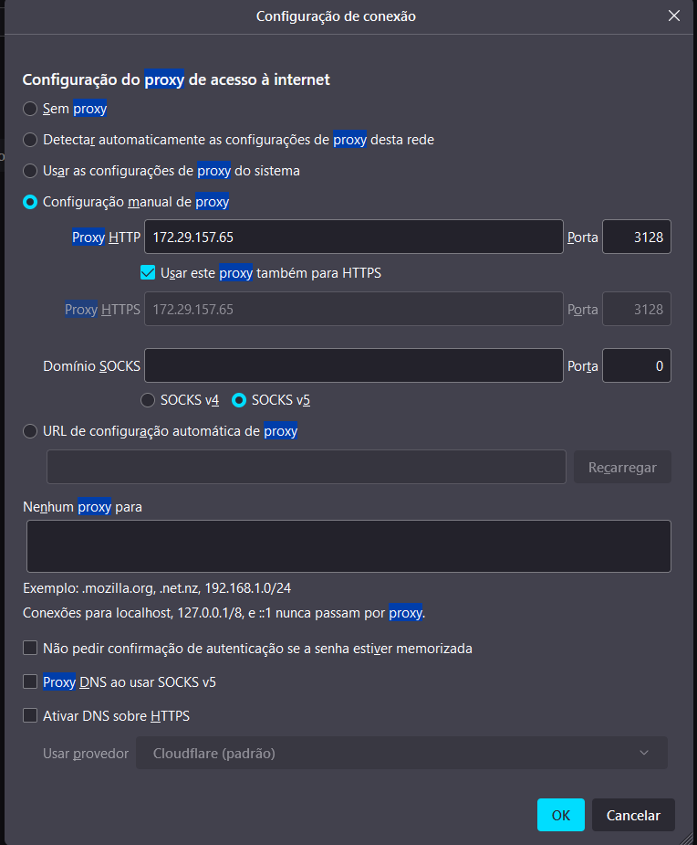

# Proxy com SQUID - Client side

- **Tópicos**

  - 1. [Download do squid e net-tools](#download-dos-programas-necessários)
  - 2. [Backup do proxy](#fazer-um-backup-do-proxy)
  - 3. [Configurações de proxy](#configurar-o-proxy)
    - 1. [Regras de bloqueio](#regra-de-bloqueio)
    - 2. [Adicionar permissões](#permissões-do-squid)
    - 3. [Inicializar o squid](#inicializar-o-squid)
  - 4. [Instalação do apache2](#configurar-o-apache)

###  Download dos programas necessários

```
sudo apt-get install net-tools
sudo apt-get install squid
sudo apt-get install apache2
```

### Fazer um backup do proxy
```
sudo cp -Rfa /etc/squid/squid.conf{,.bkp}
```

## Configurar o proxy
- Acesse a pasta do squid
  ```
  cd /etc/squid
  ```
- Em seguida, excluir a configuração do squid com o comando: `sudo rm -rf squid.conf`<br>
  Após isso, crie um novo arquivo de configuração e edite

  ```
  sudo touch squid.conf
  sudo nano squid.conf
  ```
- cole o código abaixo:
  ```
  ## DEFINE A PORTA DE CONEXAO DO SQUID
  http_port 3128

  ## DEFINE O TAMANHO MAXIMO DE UM OBJETO PARA SER ARMAZENADO EM CACHE ##
  maximum_object_size 4096 KB

  ## DEFINE O TAMANHO MINIMO DE UM OBJETO PARA SER ARMAZENADO EM CACHE ## 
  minimum_object_size 0 KB

  ## DEFINE O TAMANHO MAXIMO DE UM OBJETO PARA SER ARMAZENADO EM CACHE DE MEMORIA ## 
  maximum_object_size_in_memory 64 KB

  ## DEFINE A QUANTIDADE DE MEMORIA RAM A SER ALOCADA PARA CACHE ## 
  cache_mem 512 MB

  ## AJUSTA A PERFORMANCE EM CONEXOES PIPELINE ##
  pipeline_prefetch on

  ## CACHE DE FQDN ##
  fqdncache_size 1024

  ## OPCOES DE REFRESH PATTERN ##
  refresh_pattern ^ftp: 1440 20% 10080
  refresh_pattern ^gopher: 1440 0% 1440
  refresh_pattern -i (/cgi-bin/|\?) 0 0% 0
  refresh_pattern . 0 20% 4320

  ## DEFINE A PORCENTAGEM DO USO DO CACHE ## 
  cache_swap_low 90
  cache_swap_high 95

  ## ARQUIVO DE LOGS DO SQUID ## 
  access_log /var/log/squid/access.log squid
  cache_log /var/log/squid/cache.log
  cache_store_log /var/log/squid/store.log

  ## DEFINE O LOCAL DO CACHE ##
  cache_dir ufs /var/spool/squid 1600 16 256

  ## CONTROLE DE ROTACAO DOS ARQUIVOS DE LOGS ##
  logfile_rotate 10

  ## ARQUIVO ONDE CONTEM OS ENDERECOS LOCAIS DA REDE ##
  hosts_file /etc/hosts

  ## ACLS - PORTAS PADROES LIBERADAS ##
  acl SSL_ports port 80 #HTTP
  acl SSL_ports port 443 #HTTPS
  acl Safe_ports port 80 # http
  acl Safe_ports port 21 # ftp
  acl Safe_ports port 443 # https
  acl Safe_ports port 70 # gopher
  acl Safe_ports port 210 # wais
  acl Safe_ports port 1025-65535 # unregistered ports
  acl Safe_ports port 280 # http-mgmt
  acl Safe_ports port 488 # gss-http
  acl Safe_ports port 591 # filemaker
  acl Safe_ports port 777 # multiling http
  acl CONNECT method CONNECT

  ### DEFININDO MODO DE AUTENTICACAO
  auth_param basic program /usr/lib/squid3/basic_ncsa_auth /etc/squid/usuarios
  auth_param basic children 5
  auth_param basic realm "DIGITE SEU USUARIO E SENHA PARA ACESSO A INTERNET:"
  auth_param basic credentialsttl 2 hours
  auth_param basic casesensitive off

  ### ACL PARA GARANTIR A AUTENTICACAO DO USUARIO NOS SITES ###
  acl autenticados proxy_auth REQUIRED

  ## BLOQUEIA O ACESSO UNSAFE PORTS ##
  http_access deny !Safe_ports

  ## Deny CONNECT to other than secure SSL port ##
  http_access deny CONNECT !SSL_ports

  ## SITES BLOQUEADOS PARA ACESSO ##
  acl sites-bloqueados url_regex -i "/etc/squid/regras/bloqueados"

  ## SITES LIBERADOS PARA ACESSO ##
  acl sites-liberados url_regex -i "/etc/squid/regras/liberados"

  ## DEFININDO A ORDEM DAS REGRAS - ACLS ##
  http_access deny sites-bloqueados
  http_access allow autenticados
  http_access allow sites-liberados
  http_access deny all
  http_reply_access allow all
  icp_access allow all
  miss_access allow all

  ## NOME QUE IRA APARECER NA TELA DE ERRO OU BLOQUEIO DO SQUID ##
  visible_hostname proxy.tidahora.com.br

  ## DIRETORIO DAS PAGINAS DE ERROS ##
  error_directory /usr/share/squid/errors/pt-br

  ## OUTRAS OPCOES DE CACHE ##
  cache_effective_user proxy
  coredump_dir /var/spool/squid
  ```
  - #### Regra de bloqueio
    - Criando a pasta de regras

      ```
      sudo mkdir /etc/squid/regras
      cd /etc/squid/regras
      ```
    - Criando arquivos de bloqueados e liberados
      ```
      touch liberados bloqueados
      ```
    - Editar sites liberados para acesso
      ```
      sudo nano liberados
      ```
      Você irá colocar os domínios, conforme o exemplo abaixo

      ```
      .youtube.
      .google.
      .instagram.
      ```
      > **Nota** - Apenas é um exemplo de domínios que estão liberados, você deve adicionar os sites de sua escolha
    - Editar sites bloqueados para acesso

      ```
      sudo nano bloqueados
      ```
      Mesmo esquema dos sites liberados

      ```
      .facebook.
      .twitter.
      ```
  - #### Permissões do Squid
    - Liberar permissão ao SQUID
    
      ```
      sudo chmod -Rf 774 /var/spool/squid
      ```
  - ### Criar diretórios de troca de disco
    - Utilizado quando o Squid é instalado pela primeira vez, ou modificar a configuração do `cache_dir`

      ```
      sudo squid -z
      ```
  - ### Inicializar o Squid

    ```
    service squid start
    ```

## Configurar o apache
- Certifique de já ter o apache2 instalado
  - ### Criar o primeiro usuário no apache
    - O comando para criar um usuário pela primeira vez, é diferente do que ao criar os próximos.

      ```
      sudo htpasswd -c /etc/squid/usuarios {nome_do_usuario}
      ```
      > **Nota** - A pasta usuarios dentro do etc/squid, foi criada naquele arquivo de configuração

      > Após executar esse comando, será necessário você inserir uma senha para esse usuário
  - ### Criar usuários 
    - Para criar os demais usuários, rode o comando:

      ```
      sudo htpasswd /etc/squid/usuarios {nome_do_usuario}
      ```
  - ### Atualizar o squid
    - Como foi feita atualizações, será necessário "atualizar" o squid, rode o comando:
      ```
      sudo squid -k reconfigure
      ```
  - ### Por meio do servidor, liberar acesso a internet
    - Entre no modo root
    
      ```
      sudo su
      ```
    - Para fazer o redirecionamento de Kernel, rode o comando:
      ```
      echo 1 >> /proc/sys/net/ipv4/ip_forward
      ```
  - ### Configurar o PROXY em seu navegador
    - Você precisa descobrir qual o IP da sua máquina, pode rodar o `ifconfig` para saber isso.
    - Acesse o navegador de sua escolha, neste caso, utilizado o Firefox.
    - Vá em configurações, e pesquise por Proxy.
    - Configure, conforme a imagem abaixo.
    
      
    - Feito isso, configurado

# Possibilidades com o SQUID
 Você pode bloquear sites em usuários especificos, pode bloquear palavra chave,